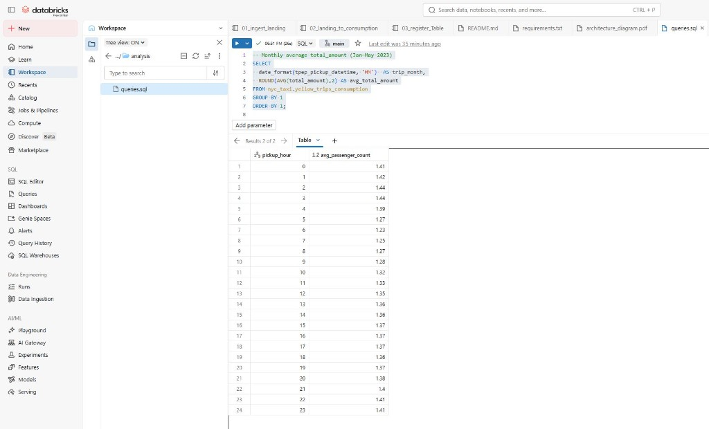
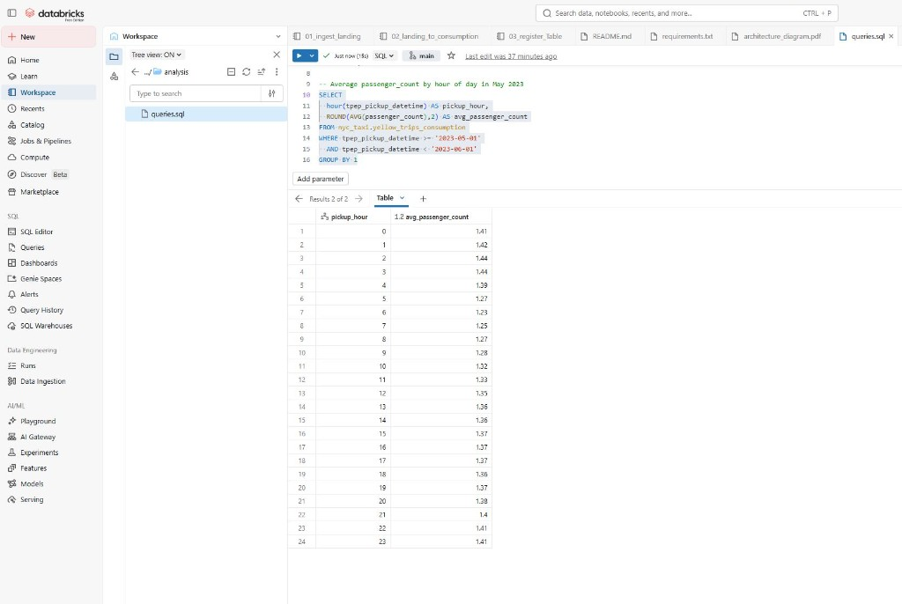

# NYC Yellow Taxi — Databricks Data Lake

Solution for ingesting NYC yellow taxi trip data (January–May 2023), building a two-layer data lake on Databricks (landing + consumption), exposing curated data via Unity Catalog, and answering the case analytical questions in SQL.

**Data source:** [NYC TLC Trip Record Data](https://www.nyc.gov/site/tlc/about/tlc-trip-record-data.page)

---

## Objective

1. Ingest original trip files into a **landing zone**
2. Clean and publish a **consumption layer** with only the required columns
3. Make data available to SQL consumers through a **catalog table**
4. Run the two analytical queries defined in the case

---

## Architecture

```text
TLC Parquet files (Jan–May 2023)
        │
        ▼
┌───────────────────────────────────────┐
│ 01_ingest_landing                     │
│  Validate / supply landing Volume     │
└───────────────────────────────────────┘
        │
        ▼
  /Volumes/.../landing/.../*.parquet   (raw)
        │
        ▼
┌───────────────────────────────────────┐
│ 02_landing_to_consumption             │
│  PySpark: cast at read, QA, cleanse    │
│  Write Delta → consumption Volume     │
└───────────────────────────────────────┘
        │
        ▼
  /Volumes/.../consumption/yellow_taxi   (Delta table on Volume)
        │
        ▼
┌───────────────────────────────────────┐
│ 03_register_Table                     │
│  Catalog API + saveAsTable → UC table  │
└───────────────────────────────────────┘
        │
        ▼
  nyc_taxi.yellow_trips_consumption      (SQL)
        │
        ▼
  analysis/queries.sql
```

| Layer | Storage | Catalog object | Notebook |
|-------|---------|----------------|----------|
| Landing | Unity Catalog Volume (`landing`) | — | `01_ingest_landing` |
| Consumption | Unity Catalog Volume (`consumption`) | — | `02_landing_to_consumption` |
| SQL serving | UC managed Delta (table storage) | `nyc_taxi.yellow_trips_consumption` | `03_register_Table` |

---

## Repository structure

```text
Databricks_nyc_taxi_challenge/
├── src/
│   ├── 01_ingest_landing.ipynb
│   ├── 02_landing_to_consumption.ipynb
│   └── 03_register_Table.ipynb
├── analysis/
│   └── queries.sql
├── README.md
└── requirements.txt
```

---

## Prerequisites

- Databricks workspace (tested on **Free Edition** with **Serverless** compute)
- Unity Catalog enabled (`workspace` or `main` catalog)
- Git repo connected in Databricks (**Repos**) optional but recommended

### Catalog objects (created in notebook 01)

| Object | Name |
|--------|------|
| Catalog | `workspace` (adjust if `spark.catalog.listCatalogs()` shows another name) |
| Schema | `nyc_taxi` |
| Volumes | `nyc_taxi.landing`, `nyc_taxi.consumption` |
| Table | `nyc_taxi.yellow_trips_consumption` (created in notebook 03) |

### Paths

| Layer | Path |
|-------|------|
| Landing | `/Volumes/workspace/nyc_taxi/landing/yellow_taxi/2023/{MM}/yellow_tripdata_2023-{MM}.parquet` |
| Consumption (Delta) | `/Volumes/workspace/nyc_taxi/consumption/yellow_taxi` |

Replace `workspace` with your catalog name if different.

---

## Data files (landing)

Download and upload **5 Parquet files** (yellow taxi, 2023-01 through 2023-05) to the landing Volume:

| Month | File |
|-------|------|
| Jan | `yellow_tripdata_2023-01.parquet` |
| Feb | `yellow_tripdata_2023-02.parquet` |
| Mar | `yellow_tripdata_2023-03.parquet` |
| Apr | `yellow_tripdata_2023-04.parquet` |
| May | `yellow_tripdata_2023-05.parquet` |

**Free Edition note:** Outbound access to TLC URLs is often blocked (`UnknownHostException`). Use **manual upload** to the landing Volume (UI: *Add or upload data → Upload files to a volume*).

---

## Execution order

Run notebooks on **Serverless** compute in this order:

1. `src/01_ingest_landing.ipynb`
2. `src/02_landing_to_consumption.ipynb`
3. `src/03_register_Table.ipynb`
4. `analysis/queries.sql` (SQL Editor or `%sql` cell)

In each notebook, run the **Setup** cell (imports + variables) first—especially after **Restart Python** or **Clear state**.

After code changes: **Run → Clear state** (or **Restart Python**) before re-running downstream notebooks.

---

## Notebook 01 — `01_ingest_landing`

**Purpose:** Landing supply and validation.

- **Setup** — imports, `CATALOG`, `SCHEMA`, `months`, `landing_base` (single source of truth)
- List catalogs with `spark.catalog.listCatalogs()`
- Create schema and volumes (`landing`, `consumption`)
- Verify all 5 expected Parquet paths exist under the landing Volume (`dbutils.fs.ls`)
- Quick validation: row counts per month (`spark.read.parquet`, `unionByName`)

**PySpark usage:** Catalog API (`listCatalogs`), `spark.read.parquet`, `unionByName`.

**Does not** write to consumption or register tables.

---

## Notebook 02 — `02_landing_to_consumption`

**Purpose:** Data quality checks, cleansing, and Delta load to the consumption Volume.

**Setup** — imports, `CATALOG`, `SCHEMA`, `months`, `landing_base`, `consumption_path` (run first).

### Read strategy

- Read **one file per month** (avoids Parquet schema conflicts across months)
- `read_month()` selects the 5 required columns and applies **all casts** (`long`, `double`, `timestamp`) before union
- `unionByName` to build the full Jan–May dataset

### Cleansing rules (consumption contract)

| Rule | Implementation |
|------|----------------|
| Required columns only | `VendorID`, `passenger_count`, `total_amount`, `tpep_pickup_datetime`, `tpep_dropoff_datetime` |
| Non-null required fields | `filter(...isNotNull())` |
| Case period | Pickup in `[2023-01-01, 2023-06-01)` and `year(pickup) = 2023` |
| Valid amounts | `total_amount >= 0` |
| Valid passenger count | `0 <= passenger_count <= 9` |
| Valid trip duration | `dropoff_datetime > pickup_datetime` |
| Fixed schema | Explicit `.cast(...)` in `read_month()` (single contract at read) |

### Write to consumption

```python
(
    df_treated.write
    .format("delta")
    .mode("overwrite")
    .save(consumption_path)
)
```

If the schema changes during development, add `.option("overwriteSchema", "true")` or delete the consumption path before re-writing to avoid `DELTA_FAILED_TO_MERGE_FIELDS`.

**PySpark usage:** Main transformation notebook (`read`, `filter`, `agg`, `unionByName`, `write` Delta).

---

## Notebook 03 — `03_register_Table`

**Purpose:** Publish the consumption Delta dataset as a Unity Catalog table for SQL consumers.

**Setup** — imports (`col`, `when`, aggregations), `CATALOG`, `SCHEMA`, `consumption_path`, `full_table`, and `spark.catalog.setCurrentCatalog(CATALOG)`.

### Register managed table

```python
spark.catalog.setCurrentCatalog(CATALOG)
spark.sql(f"DROP TABLE IF EXISTS {full_table}")

df = spark.read.format("delta").load(consumption_path)
df.write.format("delta").mode("overwrite").saveAsTable(full_table)
```

Table comment: `COMMENT ON TABLE` via `spark.sql` (DDL).

### Post-registration validation (PySpark DataFrame API)

- `spark.table(full_table).printSchema()` and `.describe()`
- `spark.catalog.getTable(full_table)` — table metadata
- `.count()` and `.limit(10)` — row count and sample
- `.agg(min, max, countDistinct, sum(when(...)))` — date range and sanity checks (e.g. `neg_amount` = 0)

### Why not `CREATE TABLE ... LOCATION '/Volumes/...'`?

Unity Catalog external tables require a **cloud URI scheme** (`s3://`, `abfss://`, `gs://`). Paths under `/Volumes/...` cannot be used as `LOCATION` for external tables (`Missing cloud file system scheme`).

**Approach chosen:** Delta files on the consumption Volume (physical curated layer) + **managed table** via `saveAsTable` (SQL serving layer). This matches common enterprise patterns (curated files + catalog table), adapted for Free Edition constraints.

**PySpark usage:** Catalog API (`setCurrentCatalog`, `getTable`), `spark.sql` for `DROP TABLE` / `COMMENT`, `read`/`write` Delta, `saveAsTable`, and DataFrame validations.

---

## Consumption schema

| Column | Type |
|--------|------|
| `VendorID` | `BIGINT` |
| `passenger_count` | `BIGINT` |
| `total_amount` | `DOUBLE` |
| `tpep_pickup_datetime` | `TIMESTAMP` |
| `tpep_dropoff_datetime` | `TIMESTAMP` |

---

## Analysis — `analysis/queries.sql`

Run against `nyc_taxi.yellow_trips_consumption` after notebook 03 (SQL warehouse or SQL Editor).

Full SQL: [`analysis/queries.sql`](analysis/queries.sql)

---

### Question 1 — Monthly average `total_amount` (yellow taxi, Jan–May 2023)

**SQL:**

```sql
SELECT
  date_format(tpep_pickup_datetime, 'MM') AS trip_month,
  ROUND(AVG(total_amount), 2) AS avg_total_amount
FROM nyc_taxi.yellow_trips_consumption
GROUP BY 1
ORDER BY 1;
```

**Results** (Databricks SQL Editor):



| trip_month | avg_total_amount |
|------------|------------------|
| 01 | 27.40 |
| 02 | 27.31 |
| 03 | 28.23 |
| 04 | 28.72 |
| 05 | 29.38 |

**Brief reading:** average fare (`total_amount`) rises slightly from January to May 2023, from **27.40** to **29.38**, on cleansed yellow taxi data.

---

### Question 2 — Average `passenger_count` by hour of day in May 2023

**SQL:**

```sql
SELECT
  hour(tpep_pickup_datetime) AS pickup_hour,
  ROUND(AVG(passenger_count), 2) AS avg_passenger_count
FROM nyc_taxi.yellow_trips_consumption
WHERE tpep_pickup_datetime >= '2023-05-01'
  AND tpep_pickup_datetime < '2023-06-01'
GROUP BY 1
ORDER BY 1;
```

**Results** (Databricks SQL Editor — 24 rows, hours 0–23):



| pickup_hour | avg_passenger_count |
|-------------|---------------------|
| 0 | 1.41 |
| 1 | 1.42 |
| 2 | 1.44 |
| 3 | 1.44 |
| 4 | 1.39 |
| 5 | 1.27 |
| 6 | 1.23 |
| 7 | 1.25 |
| 8 | 1.27 |
| 9 | 1.28 |
| 10 | 1.32 |
| 11 | 1.33 |
| 12 | 1.35 |
| 13 | 1.36 |
| 14 | 1.36 |
| 15 | 1.37 |
| 16 | 1.37 |
| 17 | 1.37 |
| 18 | 1.36 |
| 19 | 1.37 |
| 20 | 1.39 |
| 21 | 1.40 |
| 22 | 1.41 |
| 23 | 1.41 |

**Brief reading:** in May 2023, average passengers per trip stays between **1.23** (hour 6) and **1.44** (hours 2–3), with no sharp peak across the day — consistent with short urban yellow taxi trips.

---

## Technology choices

| Topic | Choice | Rationale |
|-------|--------|-----------|
| Compute | Serverless | Available on Databricks Free Edition |
| Raw storage | UC Volume `landing` | DBFS `/FileStore` disabled on Free Edition |
| Curated storage | Delta on Volume `consumption` | ACID, versioned curated layer |
| SQL access | Managed Delta table | Works without `s3://` external locations |
| Transform | PySpark (notebook 02) | Case requirement |
| Catalog / table ops | PySpark Catalog API (notebooks 01, 03) | UC-native; avoids ad hoc SQL where DataFrame API fits |
| Consumer queries | SQL (`analysis/queries.sql`) | Case requirement |

### Enterprise (Databricks on AWS/Azure/GCP)

In production, consumption would typically live on **cloud storage** (`s3://` / `abfss://`) with an **external or managed Delta table** and `LOCATION` using the cloud scheme—not only UC Volumes. The three-notebook split (landing → transform → register) remains the same.

---

## Validation queries

```sql
-- Row count
SELECT COUNT(*) AS total_rows FROM nyc_taxi.yellow_trips_consumption;

-- Month distribution
SELECT date_format(tpep_pickup_datetime, 'yyyy-MM') AS trip_month, COUNT(*) AS trips
FROM nyc_taxi.yellow_trips_consumption
GROUP BY 1 ORDER BY 1;

-- Date range
SELECT MIN(tpep_pickup_datetime) AS min_pickup, MAX(tpep_pickup_datetime) AS max_pickup
FROM nyc_taxi.yellow_trips_consumption;
```

---

## Troubleshooting

| Issue | Likely cause | Mitigation |
|-------|--------------|------------|
| `DBFS_DISABLED` on `/FileStore` | Free Edition | Use UC Volumes under `/Volumes/...` |
| `UnknownHostException` on TLC URL | No outbound network | Manual upload to landing Volume |
| `PARQUET_COLUMN_DATA_TYPE_MISMATCH` | Schema differs across months | Read month-by-month; cast all columns in `read_month()` (notebook 02) |
| `DELTA_FAILED_TO_MERGE_FIELDS` | Old Delta/table schema | `.option("overwriteSchema", "true")` or `dbutils.fs.rm(consumption_path, recurse=True)`; `DROP TABLE IF EXISTS` before notebook 03 |
| `Missing cloud file system scheme` | `LOCATION '/Volumes/...'` | Use `saveAsTable` (notebook 03) |

---

## Author / delivery

- Repository: `Databricks_nyc_taxi_challenge`
- Case: Data Architect technical challenge
- Period: NYC yellow taxi, **January–May 2023**

